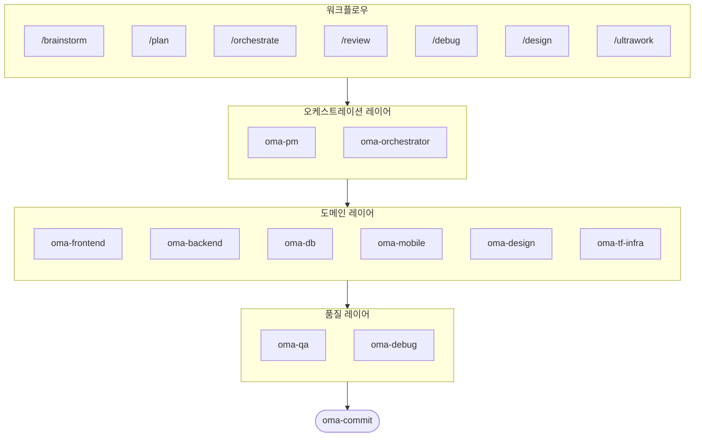

# 에이전트 팀 구성

## 전체 에이전트 맵

oh-my-agent는 <strong>14개 전문 에이전트</strong>로 구성됩니다. 이 에이전트들은 3개 레이어로 조직됩니다:



## 레이어별 설명

### 오케스트레이션 레이어

전체 작업 흐름을 관리하는 <strong>지휘자</strong> 역할입니다.

| 에이전트 | 역할 |
|----------|------|
| **oma-pm** | 요구사항 분석, 태스크 분해, 우선순위 결정, API 계약 정의 |
| **oma-orchestrator** | CLI를 통한 에이전트 병렬 스폰, 실행 모니터링, 결과 수집 |

### 도메인 레이어

각 기술 분야를 전담하는 <strong>전문가</strong> 에이전트입니다.

| 에이전트 | 전문 분야 | 핵심 스킬 |
|----------|----------|----------|
| **oma-frontend** | UI 구현 | React, Next.js, TypeScript, Tailwind, shadcn/ui |
| **oma-backend** | API 개발 | Python, Node.js, Rust, Clean Architecture |
| **oma-db** | 데이터베이스 | SQL, NoSQL, Vector DB, 스키마 설계 |
| **oma-mobile** | 모바일 앱 | Flutter, Dart, Riverpod |
| **oma-design** | 디자인 시스템 | 토큰, 접근성(WCAG 2.2), 반응형 |
| **oma-tf-infra** | 인프라 | Terraform, AWS, GCP, Azure |

### 품질 레이어

구현 결과를 <strong>검증하고 개선</strong>합니다.

| 에이전트 | 역할 |
|----------|------|
| **oma-qa** | OWASP 보안 감사, 성능 분석, 접근성 검증, 테스트 커버리지 |
| **oma-debug** | 근본 원인 분석, 최소 수정, 회귀 테스트 작성 |

### 유틸리티 에이전트

작업 흐름을 보조하는 도구 에이전트입니다.

| 에이전트 | 역할 |
|----------|------|
| **oma-brainstorm** | 구현 전 아이디어 탐색, 접근 방식 비교 |
| **oma-translator** | 자연스러운 다국어 번역, 톤/스타일 보존 |
| **oma-commit** | Conventional Commits 규격 커밋 메시지 생성 |
| **oma-dev-workflow** | CI/CD 파이프라인, 모노레포, 릴리스 자동화 |

## 에이전트 협업 예시

```
사용자: "유저 인증이 있는 TODO 앱 만들어줘"

→ oma-pm       : 요구사항 분석, 8개 태스크로 분해
→ oma-db       : users, todos 테이블 스키마 설계
→ oma-backend  : 인증 API + CRUD API 구현 (병렬)
→ oma-frontend : 로그인/회원가입 + TODO 리스트 UI 구현 (병렬)
→ oma-qa       : 보안 감사 (SQL injection, XSS) + 성능 리뷰
→ oma-commit   : 기능별 conventional commit 생성
```

::: info 🤖 핵심 원리
각 에이전트는 <strong>자기 스킬(SKILL.md)만 로드</strong>합니다.

- oma-frontend는 React 스킬만 읽음 → 토큰 절약
- oma-backend는 API 스킬만 읽음 → 역할 집중
- 전체를 다 읽는 에이전트는 없음 → 비용 최적화
:::
